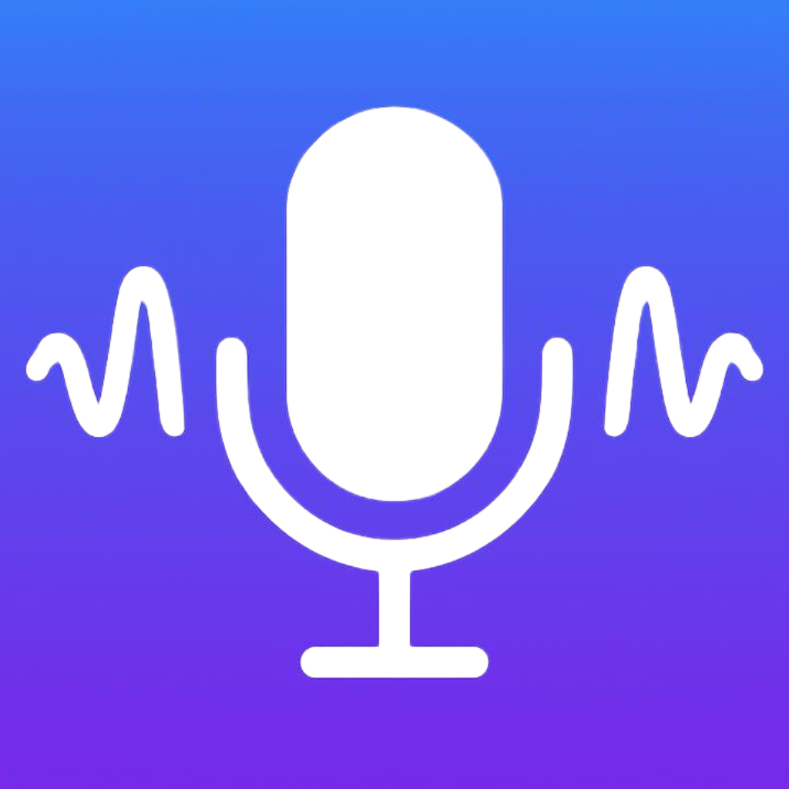

<h1>
  
  PodcastPlayer
</h1>

PodcastPlayer is an iOS app built in SwiftUI. It presents a podcast list, drills into podcast details and episodes, and supports episode playback with compact and expanded now-playing experiences.

## Features

- List of podcasts grouped by category
- Podcast details page with artwork, description, episode list, and episode metadata
- Now playing bottom sheet with playback controls including play/pause, seeking, and skip controls
- Share support for podcast details using deeplinks via the `podcastplayer://` URL scheme

## Architecture

The project follows an `MVVM`-style structure with clear feature separation:

- `Core`
  - Reusable UI components
  - Dependency injection container
  - Shared error handling
  - DTO to UI model mapping
  - Navigation router
- `Features/PodcastList`
  - Podcast discovery UI and state
- `Features/PodcastDetail`
  - Podcast detail, sharing, and episode loading
- `Features/NowPlaying`
  - Shared playback state and player UI

## Dependencies

This project uses a small set of libraries/packages:

- `PodcastPlayerNetworkingKit`
  - Custom local package for networking abstractions and request execution
- `PodcastPlayerAudioKit`
  - Custom local package for audio playback and playback state/time streams
- `PodcastPlayerDeeplinkKit`
  - Custom local package for deeplink parsing and deeplink URL generation
- `Factory`
  - Third-party dependency used for lightweight dependency injection and test mocking
- `Kingfisher`
  - Third-party dependency used for remote image downloading and caching

## Error Handling and Edge Cases

The app includes explicit handling for:

- Empty podcast responses
- Empty episode responses
- Podcast lookup failures during deeplink navigation
- Invalid or missing episode audio URLs
- Generic network or unexpected failures

UI feedback is provided through:

- `ProgressView` during loading
- `ErrorView` for recoverable and non-recoverable states
- Retry actions on list/detail fetch failures where appropriate
- Playback loading feedback in the play/pause control

## Testing

The test target uses Apple’s `Testing` framework and currently covers:

- `PodcastListViewModel`
- `PodcastDetailViewModel`
- `NowPlayingViewModel`
- `NavigationRouter`
- `DTO to UI model mapping`
- `Utils`

## Running the Project

1. Open the Xcode project/workspace for `PodcastPlayer`.
2. Select the `PodcastPlayer` app scheme.
3. Build and run on an iOS simulator or device.

## Running Tests

In Xcode:

1. Select the `PodcastPlayerTests` target or the `PodcastPlayer` scheme.
2. Run the test suite with `Product > Test`.

The local packages also include their own test targets:

- `LocalPackages/PodcastPlayerAudioKit/Tests`
- `LocalPackages/PodcastPlayerDeeplinkKit/Tests`
- `LocalPackages/PodcastPlayerNetworkingKit/Tests`

## Notes

- Category titles are shown as category IDs because the API does not provide category names.
- The featured podcast is currently a random podcast because the API does not provide a featured option.
- The project includes localized string catalogs for podcast list, podcast detail, and error messaging.
